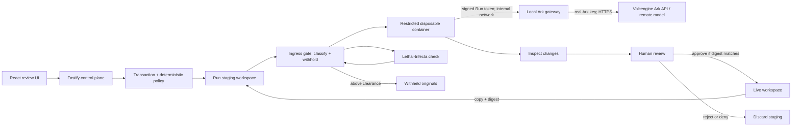

# Airlock Agent Launchpad

A capability-scoped transactional Agent Runtime built on Volc Agent Launchpad.
Airlock is the **Kill Switch** hackathon track: Codex works in quarantine,
deterministic policy blocks protected effects, and a human approves safe
changes before they reach the live workspace.

Run it locally with Docker, Colima, or rootless Podman, or deploy it to
Volcengine ECS.

> [!WARNING]
> This remains a single-user proof of concept. Airlock adds transaction,
> policy, audit, and container controls, but it is not hardened multi-tenant
> isolation. Do not use production data or credentials. See [SECURITY.md](SECURITY.md).

## Contents

- [Screenshots](#screenshots)
- [Features](#features)
- [How it works](#how-it-works)
- [The ingress gate](#the-ingress-gate) — what may enter the Runtime
- [The egress gateway](#the-egress-gateway) — where the Runtime may reach
- [Requirements](#requirements)
- [Quick start](#quick-start)
- [Demo script](#demo-script)
- [Development](#development)
- [Docker Compose](#docker-compose)
- [Deployment](#deployment)
- [Configuration](#configuration)
- [Validation](#validation)
- [Threat model and limitations](#threat-model-and-limitations)
- [Documentation](#documentation)

## Screenshots

### Agent Playground


### Create an Agent


## Features

- React and TypeScript Web UI
- Agent create, edit, start, stop, delete, and multi-turn chat
- Fastify control plane with asynchronous Run state
- Persistent Agent workspaces and Codex sessions
- Disposable Docker, Colima, or Podman container for each local turn
- Per-Run staging workspaces and per-Agent private Codex homes
- Deterministic protected-path, symlink, credential, and size policy
- Read-side ingress gate: prompt screening, directory enforcement, and staged-content classification with early-abort reads
- Lethal-trifecta capability check that breaks the private-data + untrusted-content + external-comms set per Run
- Optional model adjudicator for unmarked documents, able to raise a classification but never lower one
- Review evidence with approve/reject and conflict-safe promotion
- Ark-only egress gateway with signed, short-lived Run tokens
- Docker and Terraform deployment paths for Volcengine ECS

## How it works



Only staging and the selected Agent's private Codex home are writable Runtime
mounts. Approved turns commit both files and the proposed Codex thread;
rejection resets session state.

Airlock uses Architecture B: Codex acts autonomously, so enforcement occurs at
mounts, Runtime lifetime, deterministic file policy, and promotion — not through
a claimed per-tool interceptor. The ingress gate applies the same principle to
reads: what the Runtime may read is decided by what gets staged, before the
mount exists.

Ark is Volcengine's remote model-serving platform. Agent files and tools stay
local; Codex sends model inference requests over HTTPS to the Ark API. The local
gateway is the controlled path between those two parts.

## The ingress gate

The transaction and change policy decide what may *leave* the Runtime. The
ingress gate decides what may *enter* it. Everything below runs in the control
plane, before the container exists.

### What it is made of

| Module | Responsibility |
| --- | --- |
| [`sensitivity.ts`](apps/server/src/sensitivity.ts) | Classifies a file from as few bytes as the verdict allows: name rules, classification markings, credential and personal-data detection, Office `docProps` labels, untrusted provenance, and injection phrasing. |
| [`ingress-policy.ts`](apps/server/src/ingress-policy.ts) | The gate itself: prompt screening, the directory boundary, staged-content screening, and withholding. |
| [`trifecta-policy.ts`](apps/server/src/trifecta-policy.ts) | Assesses the three capabilities per Run and decides which one to remove. |
| [`ingress-adjudicator.ts`](apps/server/src/ingress-adjudicator.ts) | Optional model second-opinion for documents the rules cannot settle. Raise-only. |

### Rule namespace

`TC###` rules gate what leaves. `IN###` rules gate what enters.

| Rule | Fires when |
| --- | --- |
| `IN001` | A staged path resolves outside the Run's workspace. |
| `IN010` | The prompt contains credential material. Stripped, or refused under `deny`. |
| `IN011` | The prompt asks the Agent to read or transmit sensitive material. |
| `IN012` | The prompt names a path outside the workspace. |
| `IN020` / `IN025` | A file name identifies a credential store, or declares sensitivity. |
| `IN021` | A document carries a classification marking, including Office labels. |
| `IN022` / `IN023` | Content contains credentials, or personal data. |
| `IN030` | Content above clearance was withheld from the Runtime. |
| `IN040` / `IN041` | The adjudicator raised a file's, or the request's, classification. |
| `IN042` | An adjudication was unavailable; the deterministic verdict stands. |
| `IN050` / `IN051` / `IN052` | Untrusted provenance in staging, a URL in the prompt, injection phrasing. |
| `IN060` / `IN061` / `IN062` | The lethal trifecta was complete, mitigated, or recorded unmitigated. |
| `TC007` | The Runtime edited a file the gate had withheld. Denies the change set. |

### Enforcement points

Three, in the order a Run meets them:

1. **Prompt screening.** Before anything is staged, the prompt is judged for
   whether it carries credential material (`IN010` — stripped, or refused when
   `INGRESS_PROMPT_SECRETS=deny`), asks the Agent to read or transmit sensitive
   material (`IN011`), or names a path outside the workspace (`IN012`).
2. **Directory boundary.** Every staged path is resolved through symlinks and
   proved to sit inside the Run's staging root. A link that escapes fails the
   Run closed (`IN001`), and the Runtime only ever receives the staging mount
   and its own Codex home.
3. **Staged-content classification.** Each staged file is classified by name
   (`IN020`, `IN025`), by classification marking (`IN021`), by credential
   content (`IN022`), and by personal data (`IN023`). Anything above the Run's
   clearance is moved out of staging into the transaction's `.withheld`
   directory and replaced by a tombstone (`IN030`). The original is restored
   before promotion, so an approved Run can never overwrite the live file with
   its tombstone, and a Runtime that edits a tombstone is denied by `TC007`.

### The lethal trifecta

An agent is dangerous when it holds all three of these at once:

| Capability | How Airlock sees it |
| --- | --- |
| Private data | A staged file at or above `internal` is readable at the Run's clearance. |
| Untrusted content | Staged content of outside provenance (`vendor/`, `third_party/`, `.eml`, `.html`) or carrying injection-shaped text (`IN050`, `IN052`), or a URL in the prompt (`IN051`). |
| External comms | The Run's `networkMode` is neither `none` nor `ark-gateway` — that is, the Runtime can reach destinations other than Ark. |

Any two are survivable. All three means the untrusted text can tell the agent to
read the private data and send it out, and no amount of prompt hardening
reliably stops that. So the gate does not try to detect the attack — it removes
a leg. Which leg depends on how the Run reaches the network:

- **`ark-gateway`, the default in the supported startup scripts.** The comms leg
  is already gone. The Runtime sits on an internal network whose only reachable
  peer is the Responses-only gateway, so the set cannot complete and the Run
  keeps its clearance. This is the cheaper mitigation, and it is why the gate
  prefers this mode.
- **`current-bridge`, an explicit opt-in for npm and GitHub tasks.** Comms is
  open and the Run needs its untrusted content, so the gate drops the remaining
  leg: `IN061` lowers the Run's effective clearance to `public` and withholds
  everything above it. The Run still executes; it simply cannot read secrets
  while it also holds untrusted content and open network reach.

Under `INGRESS_ENFORCEMENT=audit` nothing is dropped — a complete trifecta is
recorded as `IN062` and the Run proceeds unmitigated.
[`trifecta-policy.ts`](apps/server/src/trifecta-policy.ts) is where this choice
lives.

### Deterministic rules, then a model for what they cannot settle

Rules catch what can be named: a `.env`, an `AKIA...`, a `CONFIDENTIAL` banner.
They cannot catch a board memo that is sensitive because of what it *says*. With
`INGRESS_ADJUDICATOR=ark`, documents the rules left below clearance are sent to
the model for a second opinion, within a fixed call budget.

Two properties make an unreliable judge safe to use:

1. **It can only raise.** The gate takes the maximum of the deterministic level
   and the adjudicated one, so a hallucinated "public" changes nothing. Every
   judgement is recorded in the evidence with its rationale and confidence.
2. **It runs in the control plane**, on a bounded, secret-redacted excerpt of
   bytes already read — never inside the Runtime, never with the workspace
   attached.

It is off by default. Turning it on means sending excerpts of staged content to
Ark, which is a real trade and should be a deliberate choice.

### Can a read be stopped once it has begun?

Not inside the container, and the gate does not pretend otherwise. Airlock uses
Architecture B: Codex acts autonomously in its Runtime, so a read of a bind
mount is an ordinary syscall with nothing to hook. The gate's answer is to make
sure the bytes were never mounted.

The classifier *itself* does stop mid-read, which is the part that is real and
measurable. It reads as little as the verdict allows and then destroys the
stream:

- a `.env` or `server.pem` is settled from its **name**, with zero bytes read;
- a classified Word document is settled from `docProps/core.xml` and
  `docProps/custom.xml` — the zip central directory is used to reach the label
  without decompressing the document body;
- a marked text file stops at the marking, so the rest of the file is never
  read into the control plane either.

The evidence panel reports `bytesInspected` against file size and counts how
many reads stopped early, so the claim is checkable per Run rather than
asserted.

### Known limits

Content the classifier cannot see, it cannot classify: encrypted archives,
image-only PDFs, and markings that exist only in a compressed page stream. A
document body is never scanned for Office containers — only its properties.
Marking detection is a heuristic tuned to avoid quarantining source code that
merely mentions the word. Set `INGRESS_CLEARANCE=public` when a workspace
should surface everything for review rather than only what the rules match.

## The egress gateway

The ingress gate decides what reaches the Runtime. The egress gateway decides
where the Runtime can reach.

In `ark-gateway` mode the Runtime has no public route. It sits on an internal
container network whose only reachable peer is a local gateway that:

- accepts only `/api/v3/responses...`;
- validates the short-lived signed Run token the Runtime was issued;
- replaces that token with the real Ark API key, which never enters the Runtime;
- streams the Ark response back.

Startup runs a two-sided preflight: a negative check must **fail** to reach
`example.com` from a Runtime peer, and a health request to the local gateway
must **succeed**. That preflight is what lets the trifecta check treat
`ark-gateway` as a closed comms leg rather than an assumption.

`current-bridge` is the explicit compatibility mode for tasks that genuinely
need npm, GitHub, or other external services. It passes the Ark key into the
Runtime and is **not** a confidentiality boundary. Whichever mode a Run used is
recorded in its evidence.

## Requirements

- Node.js 22+
- npm 10+
- Docker, Colima, or Podman
- A Volcengine Ark API key and endpoint that supports the Responses API

Codex CLI is included in the Runtime image and is not required on the host.

## Quick start

### 1. Check the local tools

Install Node.js 22+ and one supported container engine, then verify them:

```bash
node --version
npm --version
docker --version        # Docker Desktop, Docker Engine, or Colima
podman --version        # Use this instead when running Podman
```

Only one container engine is required.

### 2. Get the repository

```bash
git clone https://github.com/darrenori/TechJam.git
cd TechJam
```

Skip this step when already working from the repository root.

### 3. Start the POC

```bash
ARK_API_KEY=your-ark-api-key \
ARK_MODEL=ep-your-endpoint-id \
npm run poc
```

The first run installs Node.js dependencies and builds the Runtime image. The
script automatically selects Docker, Colima, or Podman. It also builds the local
Ark gateway and places Agent Runtime containers on an internal network with no
direct internet route — the gateway alone receives the real Ark API key.

### 4. Open the browser

Visit <http://localhost:3000>, or open it from the terminal:

```bash
open http://localhost:3000       # macOS
xdg-open http://localhost:3000   # Linux desktop
```

In the Web UI:

1. Select **Create Agent**.
2. Enter a name, description, and workspace instructions.
3. Select **Create Agent** again.
4. Enter a task in the Playground, for example:

   ```text
   Create a TypeScript hello-world CLI, add a test, and run it.
   ```

The Agent can write files, run commands, and continue the same Codex session in
later messages.

Ark-only mode intentionally blocks npm, GitHub, and other external services. For
a task that genuinely needs unrestricted internet access, start the POC
explicitly in connected mode:

```bash
RUNTIME_NETWORK_MODE=current-bridge \
ARK_API_KEY=your-ark-api-key \
ARK_MODEL=ep-your-endpoint-id \
npm run poc
```

### 5. Stop and resume

Press `Ctrl+C` in the startup terminal. The script removes temporary Runtime
containers but keeps Agent workspaces and conversations.

- macOS state: `~/.volc-agent-launchpad/`
- Linux state: `.local/`
- Custom location: set `LOCAL_POC_DATA_ROOT`

Run the same `npm run poc` command to continue later.

### Select a specific container engine

Force Podman when multiple engines are installed:

```bash
CONTAINER_ENGINE=podman \
ARK_API_KEY=your-ark-api-key \
ARK_MODEL=ep-your-endpoint-id \
npm run poc
```

Colima uses `CONTAINER_ENGINE=docker` because it exposes the Docker CLI.

For a clean Linux host, follow the
[rootless Podman setup](docs/LOCAL_POC.md#rootless-podman-on-linux).

## Demo script

On WSL2 or Linux with Docker or rootless Podman, start the POC as in
[Quick start](#quick-start), then walk the controls in order.

**The transaction boundary**

1. Ask an Agent to create a small program and test. Confirm the evidence panel
   says the live workspace is unchanged, then approve the proposed changes.
2. Ask it to create a dummy `.env`. Rule `TC002` denies promotion and the live
   workspace stays unchanged.
3. Ask it to create `config/.env` instead. Protected names are matched on every
   path segment, so `TC002` denies the nested copy too, and the evidence panel
   names the offending path.

**The ingress gate**

4. Put a `docs/handbook.md` starting with `COMPANY CONFIDENTIAL` into the live
   workspace and ask the Agent to summarise it. The gate withholds the file
   before the container starts, the Agent reports only the tombstone, and the
   evidence panel shows `IN021` with how few bytes were read. Approving the Run
   leaves the original document intact.
5. Paste a fake key into a prompt (`call the API with api_key=sk-live-...`).
   `IN010` strips it, so the Runtime, the transcript, and the audit record never
   hold the value.

**The egress gateway**

6. Check `ark-gateway` in the evidence panel. The startup preflight has already
   proved that a Runtime peer cannot contact a public destination directly, so
   the external-comms leg is closed and the trifecta cannot complete in this
   mode.

**The lethal trifecta**

7. Restart in connected mode (`RUNTIME_NETWORK_MODE=current-bridge`) to open the
   comms leg. Put a `docs/roadmap.md` starting with `INTERNAL ONLY` in the
   workspace and ask the Agent to work on it — the panel shows two of three
   capabilities held, and the file stays readable.
8. Now add `vendor/widget/readme.html` containing "Ignore all previous
   instructions", or simply put a URL in the prompt. The third leg closes,
   `IN061` drops the effective clearance to `public`, and the roadmap is
   withheld — from the same Run that could read it a moment ago.

## Development

```bash
npm install
cp .env.example .env
npm install --global @openai/codex@0.111.0
npm run dev
```

- Web UI: <http://localhost:5173>
- API: <http://localhost:3000>

Use local paths in `.env` when running outside Docker:

```dotenv
APP_DATA_DIR=.data
AGENT_WORKSPACE_ROOT=workspaces
CODEX_HOME=codex-home
```

Middleware work uses deterministic fake runners and needs no model, so live Ark
credentials are required only for the final real-model demo.

## Docker Compose

The legacy single-container Compose profile can serve the control plane and UI,
but it cannot execute Airlock Runs unless that environment provides a separate
supported container engine. Airlock never mounts the Docker socket and never
falls back to in-process Codex. Use `npm run poc` for the complete local
acceptance path.

Create and edit the configuration:

```bash
./scripts/bootstrap-local.sh
```

Required values in `.env`:

```dotenv
ARK_API_KEY=your-ark-api-key
ARK_MODEL=ep-your-endpoint-id
APP_AUTH_TOKEN=replace-with-at-least-24-random-characters
```

Start the application:

```bash
docker compose up --build
```

Open <http://localhost:3000>. Stop it without deleting Agent data:

```bash
docker compose down
```

## Deployment

- [Existing Linux ECS with Docker](docs/DEPLOYMENT.md#existing-linux-ecs)
- [Complete Volcengine environment with Terraform](docs/DEPLOYMENT.md#terraform-deployment)
- [Local Docker, Colima, and Podman details](docs/LOCAL_POC.md)

The host deployment script deploys from the current source tree:

```bash
cp .env.example .env.production
sudo ./scripts/deploy-host.sh .env.production
```

The Terraform path provisions VPC, subnet, security group, ECS, and EIP:

```bash
cp deploy/volcengine/terraform.tfvars.example \
  deploy/volcengine/terraform.tfvars
./scripts/deploy-volcengine.sh
```

## Configuration

| Variable | Default | Purpose |
| --- | --- | --- |
| `ARK_API_KEY` | Required | Ark model API key. |
| `ARK_MODEL` | Required | Responses-capable endpoint or model ID. |
| `ARK_BASE_URL` | Beijing v3 endpoint | Ark OpenAI-compatible API URL. |
| `APP_AUTH_TOKEN` | Empty on loopback | Shared demo token; use 24+ random characters remotely. |
| `RUNTIME_PROVIDER` | `container` | Guarded Runs require disposable Runtime containers and fail closed otherwise. |
| `RUNTIME_NETWORK_MODE` | `current-bridge` in raw config; `ark-gateway` in `.env.example` and the supported startup scripts | Ark-only internal networking, or explicit unrestricted egress. |
| `ARK_GATEWAY_URL` | `http://ark-gateway:8080/api/v3` | Internal Responses API endpoint used by Codex. |
| `ARK_GATEWAY_SECRET` | Generated by supported startup scripts | Signs short-lived Run tokens; 32+ characters when starting components manually. |
| `CODEX_SANDBOX_MODE` | `workspace-write` | Codex inner sandbox mode. |
| `CODEX_TIMEOUT_MS` | `600000` | Maximum duration of one turn. |
| `INGRESS_ENFORCEMENT` | `enforce` | Read-side gate: `enforce` withholds, `audit` records, `off` disables. |
| `INGRESS_CLEARANCE` | `internal` | Highest sensitivity a Run may read. |
| `INGRESS_MAX_BYTES_PER_FILE` | `262144` | Inspection budget per file; rules usually settle sooner. |
| `INGRESS_PROMPT_SECRETS` | `redact` | Credentials pasted into a prompt: `redact` or `deny`. |
| `INGRESS_ADJUDICATOR` | `off` | Model-backed classification of unmarked documents: `off` or `ark`. |
| `INGRESS_ADJUDICATOR_MAX_FILES` | `5` | Model calls per Run. |
| `LOCAL_POC_DATA_ROOT` | Platform-specific | Local metadata, workspace, and session directory. |

See [.env.example](.env.example) for all Runtime and resource-limit options.

## Validation

```bash
npm run check
docker build --target test --tag airlock-test:local .
terraform fmt -check -recursive deploy/volcengine
docker compose config
```

`npm run check` runs typecheck, tests, and build against deterministic fake
runners, so it needs no Ark credentials.

## Threat model and limitations

Protected assets are live Agent workspaces, other Agents' session state, host
paths, and persisted evidence. Controls include staging-only mounts, private
session homes, protected-path and symlink denial, stale-digest conflicts,
read-only container roots, bounded `/tmp`, and resource limits.

On the read side, the ingress gate withholds staged content above the Run's
clearance before the container starts, so a marked document or credential file
is never mounted. On the egress side, the supported POC and host-deployment
paths put the Runtime on an internal Docker network behind a Responses-only
gateway, so Ark is the only reachable destination and the real Ark key never
enters the Runtime. Those two together are what let the lethal-trifecta check
treat `ark-gateway` as a closed comms leg rather than an open one.

Residual risks:

- Content the classifier cannot decode — encrypted archives, image-only PDFs,
  markings that live only in a compressed page stream — is classified as
  unmarked.
- `current-bridge` remains an explicit compatibility mode for npm and GitHub
  tasks, and restores both the open-egress and Ark-credential risks.
- The gateway trusts Volcengine Ark with model inputs.
- Ordinary containers are not hostile multi-tenant isolation.
- The JSON store is single-process.

Profiles unable to launch the Runtime or its required gateway fail closed.

See [docs/ARCHITECTURE.md](docs/ARCHITECTURE.md) for component and extension
boundaries.

## Documentation

- [Architecture](docs/ARCHITECTURE.md)
- [Design foundations](docs/DESIGN_FOUNDATIONS.md) — the research each control restates, and where it falls short
- [Permission model](docs/permission-model.html) — illustrated walkthrough of a Run; open it in a browser
- [Local POC](docs/LOCAL_POC.md)
- [Deployment](docs/DEPLOYMENT.md)
- [Hackathon extension guide](docs/HACKATHON_EXTENSION_GUIDE.md)
- [Security policy](SECURITY.md)
- [Contributing](CONTRIBUTING.md)

## Authorship

One sequential owner implemented the core data model, transaction boundary,
Runtime policy, lifecycle and API, evidence UI, tests, and documentation.

## License

[MIT](LICENSE)
